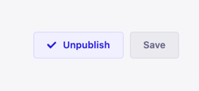

# MD CMS, a flat file markdown cms

## TODO

### Immediate tasks and basic story

- Add default screen with a "Please select or create a file"
- Add create-file state
  - Click on "create new file" opens the edit state
  - A file placeholder to the fs-tree
  - Add a publish button
    
    - Disabled until all fields are filled
    - Un-publish once a post is published
- Add edit-file state
  - Update button
    - "Update the file content?" + yes/no
  - Click on filename
    - "New file path" + a save button.
- Delete a file button
  - "Delete the file entirely?" + yes/no

Done

✅ Edit a file content

### Next

- Represent file navigation on browser
- Sync the md presentation component with an external one
- Live push file update to the browser
- Re work jest's environment
  - Add jest typeahead
- Add lint rules
  - Import order
  - cypress, no only
  - react, exhaustive hooks
  - no unused vars
  - prettier
- Add git support
  - Commit, pull and push from browser
  - Diff between branches
- Add documentation
- Add server interactivity
  - Notify about
    - Folder creation
    - File save/update/delete
  - Prettier notifications for existing consoles
- Support local drafts -> file store in a separate
  folder that's ignored from git. Or simply use local-store.

## Publishing to npm

To release an alpha use

```
npm version prerelease --preid=alpha
``` 
